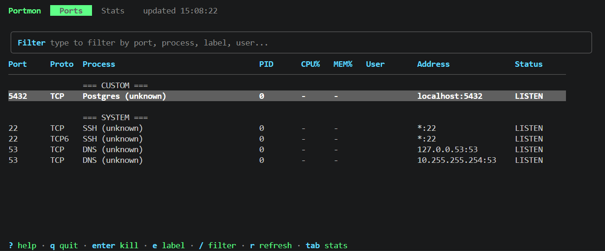

# portmon

Terminal dashboard for live port inspection and lightweight system stats. `portmon` is mainly for figuring out what is listening where, which process owns it, and which noisy ports should be labeled or hidden.



**Live demo:** [froesch.dev](https://froesch.dev)

## Install

Supported platforms: Linux and macOS.

Linux has full support. On macOS, port scanning works, but the stats tab is Linux-only.
Native Windows is not supported yet. On Windows, use WSL for the ports view.

Recommended:

```bash
curl -fsSL https://raw.githubusercontent.com/LFroesch/portmon/main/install.sh | bash
```

Other options:

```bash
go install github.com/LFroesch/portmon@latest
make install
```

Windows:

```powershell
./install.ps1
```

```bat
install.cmd
```

Both Windows installer entrypoints exit with a clear unsupported message on native Windows.

Run:

```bash
portmon
portmon --version
```

## Tabs

| Tab | Purpose |
|-----|---------|
| Ports | Live table of listening and active ports with process info |
| Stats | Linux system dashboard with CPU, memory, disk, network, and top processes |

## Features

- Live port table with PID, process name, owner, address, CPU, and memory
- Custom labels and hidden-port rules from config
- Fast inline filtering
- Process kill flow with confirmation
- Linux stats dashboard with sparklines

## Config

Config is created on first run at `~/.config/portmon/config.json`.

```json
{
  "refresh_interval": 2,
  "port_mappings": [
    {
      "port": "3000",
      "custom_name": "React App",
      "description": "Frontend dev server",
      "hidden": false
    }
  ]
}
```

Use `e` in the app to add or clear custom labels directly from the Ports tab.

## Requirements

- Linux: `netstat` or `lsof`
- macOS: `lsof`
- Stats tab on Linux also relies on `/proc`

Native Windows support is currently blocked by Linux-specific filesystem and syscall usage in the stats/runtime paths.

If neither scanner is available, `portmon` shows an explicit warning instead of an empty table.

## Controls

| Key | Action |
|-----|--------|
| `tab`, `1`, `2` | Switch tabs |
| `/` | Filter ports |
| `j/k` | Move |
| `e` | Edit label |
| `enter` | Kill selected process |
| `r` | Refresh |
| `x` | Reload config |
| `c` | Show config path |
| `?` | Help |
| `q` | Quit |

## License

[AGPL-3.0](LICENSE)
